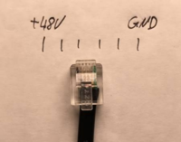
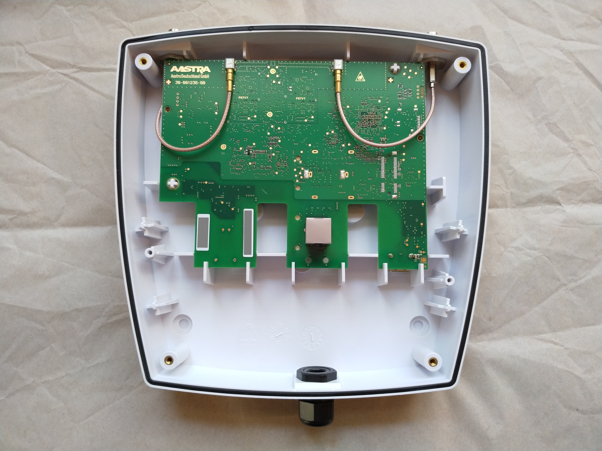
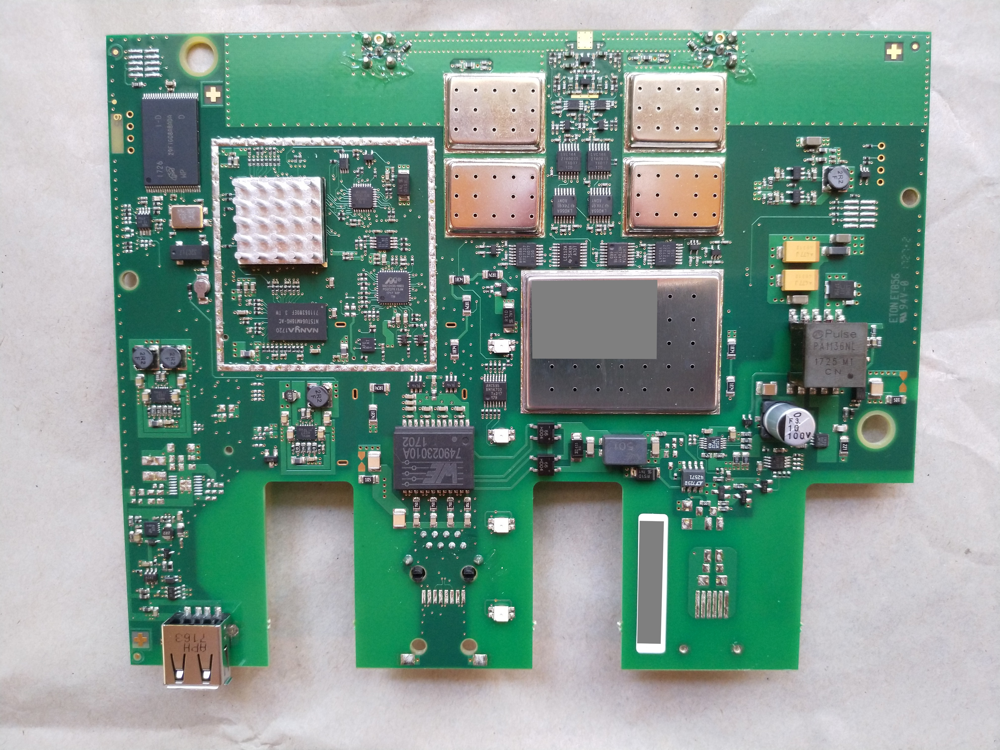
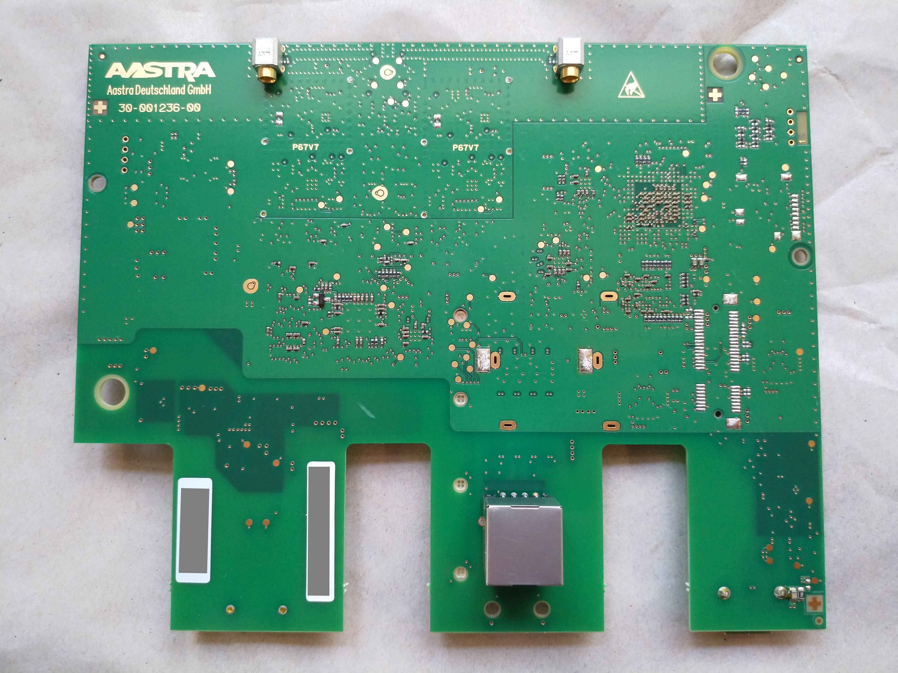
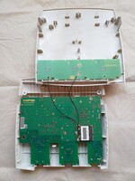
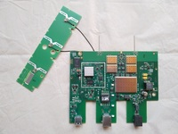
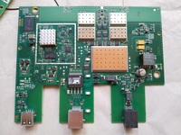
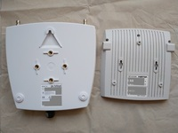
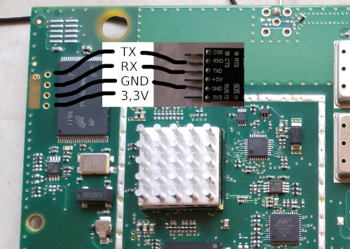

How-to DECT: Setting up a Mitel SIP-DECT RFP for home/enthusiast use
====================================================================

* Table of contents
{:toc}

## Intro

DECT telephony, courtesy of Eventphone, has been a staple of hacker conferences
for [years][ep-history].  
Recently, Eventphone has [improved their registration and management
system][newsys] and [presented more information on its inner workings][mifail].
There has also been some [investigation into the internal hardware and
protocols of the Mitel SIP-DECT RFP hardware][dissection].

[ep-history]: https://media.ccc.de/v/35c3oio-70-eventphone-frher-heute-morgen-
[newsys]: https://media.ccc.de/v/eh19-179-das-neue-eventphone-poc-telefonsystem
[mifail]: https://media.ccc.de/v/36c3-10576-mifail_oder_mit_gigaset_ware_das_nicht_passiert
[dissection]: https://media.ccc.de/v/osmodevcon2019-100-aastra-mitel-dect-base-station-dissection

With all this information at the ready, one might decide to try and replicate
the familiar DECT setup at home.  
Even with these excellent (and entertaining!) resources, however, SIP-DECT is
very much an enterprise solution and can be a bit daunting to set up for your
own personal use.  
Think for a few moments whether you really want to go through with this, or if
you already have plenty of other side-projects to occupy your time. Then,
probably, read on. ;)

## Glossary: What is SIP-DECT?

Just to recap:

- **DECT** is a wireless communication standard that is, among other things, used
  for cordless telephones.
- **SIP** is technically only a "signalling protocol" (it does say "Session
  Initiation" in the name), but is colloquially used to refer to network-based
  telephony ("Voice-over-IP") in general.
- **SIP-DECT** is a line of products by *Mitel* (see below) that combines the
  two: SIP-DECT devices act as DECT base stations and SIP clients, allowing
  DECT phones to make calls via a SIP server.
- **Mitel** purchased Aastra in 2013, who had in turn purchased DeTeWe in 2005, so
  you'll find all three company names mentioned somewhat interchangeably when
  it comes to SIP-DECT equipment.

The SIP-DECT setup uses several more terms and abbreviations. You'll primarily
come across:

- **RFP** (Radio Fixed Part):  
  Simply put, a DECT base station.  
  *You can have one or multiple of these.*
- **PP** (Portable Part):  
  A DECT phone handset.  
  *You can have one or multiple of these.*
- **OMM** (Open Mobility Manager):  
  A piece of software (running as a permanent service) that accepts your
  configuration settings, coordinates communication across all *RFP*s, and acts
  as the interface between SIP and DECT. The *OMM* has a web interface that
  allows you to configure most (but not all) settings.  
  *You will usually have one instance of this, possibly with a second instance
  as fallback. You might use the web interface for the inital installation, and
  occasionally for administrative tasks afterwards.*
- **OM Configurator**:  
  A piece of software (an administrative GUI) that allows you to configure
  Mitel *RFP*s' basic settings: IP address, network boot paths, *OMM* addresses
  they should use.  
  *You might need to use this once for the initial installation, then not need
  it anymore.*
- **OMP** (OM Management Portal):  
  A piece of software (an administrative GUI) that allows to configure your
  *OMM*. Similar features to the *OMM*'s own web interface, but some options
  are available only in the web interface, or only in the *OMP*.  
  *You might use this for the inital installation, and occasionally for
  administrative tasks afterwards.*
- **PARK** (Portable Access Rights Keys):  
  *TODO*
- **IPEI** (International Portable Equipment Identity):  
  The IPEI is a 36 Bit unique identifier for the PP, consisting of 16 bits EMC 
  (Equipment Manufacturer's Code) and 20 Bits PSN (Portable Serial Number) and 
  is issued by the manufacturer. The decimal representation should consist
  of 5 digits EMC, 7 digits PSN and one digit modulo 11 sum.


## Hardware: RFP generations

The SIP-DECT RFP hardware exists in several feature classes and has gone
through several years of development. The model numbers that arise from this
are, shall we say, *creative*.

The naming follows the schema "RFP *number* [IP|WLAN]".  
"IP" models can only act as a DECT base station; "WLAN" models can provide both
DECT base station and WiFi access point service at the same time. Both DECT and
WiFi functionality can be enabled/disabled in the configuration.

There used to be "*number*L" models that included a license for multiple RFPs.
As of SIP-DECT 6.0, licenses are independent from RFP models; there is no
distinction between L- and non-L-RFPs anymore.
(see also: [section "Licensing"](#licensing))

RFPs exist in indoor and outdoor variants (easily distinguished by their smooth
vs rugged case).  
Do not use an indoor variant outdoors; its circuit board will corrode, which is
generally a bad thing.

### Model overview

Let's look at an overview (as of the release of SIP-DECT v8.0):

|                | indoor, 4 speech channels | indoor, 8 speech channels                  | outdoor, 8 speech channels        | identification characteristic      |
|----------------|---------------------------|--------------------------------------------|-----------------------------------|------------------------------------|
| UpN (non-IP)   | -                         | 21, 22                                     | 23, 24                            | rectangular with protrusion, 1 LED |
| 1st generation | -                         | 31 IP, 41 WLAN                             | 33 IP                             | smooth edges, no USB port, 1 LED   |
| 2nd generation | -                         | 32 IP, 42 WLAN                             | 34 IP                             | smooth edges, no USB port, 4 LEDs  |
| 3rd generation | -                         | [35 IP][rfp35ip], 43 WLAN                  | 36 IP (PoE-only), 37 IP (ext-ant) | smooth edges, USB port, 4 LEDs     |
| 4th generation | 44 IP                     | [45 IP][rfp45ip], 47 IP (ext-ant), 48 WLAN | 47 IP DRC                         | "modern" angular look, no USB port |

(PoE-only): power only via PoE, no RJ11 power input  
(ext-ant): external antenna connector, no internal DECT antenna  
IP: only contains a DECT base station  
WLAN: contains both a DECT base station and a WiFi AP  
DRC: preinstalled with directional antennas in an outdoor enclosure

You can see a 3rd gen (whose case is nearly identical to that of a 2nd gen) and
a 4th gen RFP in [this photo by Eventphone][gen3-4-photo].

[rfp35ip]: https://www.telefonanlage-shop.de/Aastra-EOL-END-OF-LIFE-TK-Systeme-DECT-Systeme-244/Aastra-RFP-35-IP-indoor-709#link_3
[rfp45ip]: https://www.telefonanlage-shop.de/Aastra-DECT-Systeme-SIP-DECT-RFP-62/Mitel-RFP-45-IP-indoor-2221#link_3

### Selecting an RFP

For a home/enthuasiast setup, you probably won't be too picky about speech
channels and indoor/outdoor variants.
You should, however, pay attention to the generation:

- Gen 1 and the earlier UpN-connected (instead of IP) models are meant to be
  used with the ([now discontinued][opencom-eol]) [OpenCom][opencom] telephony
  system and **will not work** with SIP-DECT at all.
- Gen 2 is pretty much outdated by now — it does not support DECT encryption,
  has to boot via TFTP on each powercycle because it has no internal flash,
  is only supported up to SIP-DECT version 8.0 (removed in 8.1), etc.
  Basically, avoid it.
- Gen 3 is commonly used by Eventphone — it is new enough to run the latest OMM
  version, and its USB port is very handy for configuration resets, software
  upgrades, and perhaps powering a small router or network switch.
  These should work well for home/enthuasiast deployments like ours.
- Gen 4 is up-to-date and fancy, but doesn't have a USB port, which makes
  software updates a bit more tricky. Configuration resets are done via a
  button, rather than a USB memory stick. Experience with this generation is
  sparse in enthusiast circles, so you might be on your own when you encounter
  difficulties.

[opencom]: https://www.also.com/pub/assets/87dfdacb-0880-413b-a5d3-00a3e033b311.pdf
[opencom-eol]: https://www.telefonanlage-shop.de/News/20-Ankuendigung-Vertriebsende-OpenCom-100-Serie

### Buying an RFP

RFPs can cost upwards of 450€ per piece when new.  
There is a second-hand market for used devices, but even those are not exactly
"cheap").  
You will usually find several offers for RFPs on common auction sites, but it
may take some patience to find ones in the 100€ range. (The Eventphone
presentation mentions offers around 50€, but those mostly applied to bundles of
multiple RFPs and have become a rare exception now that documentation for
SIP-DECT setups is becoming more accessible.)

As long as the hardware is functional, you should have nothing to worry about:
there are means to reset the configuration even if the seller has not provided
the passwords.

## Plugging it in: Getting your RFP(s) up and running

### Powering the RFP

Gen 2 and 3 RFPs can be powered via Power over Ethernet or via an RJ11 power
connector.  
Gen 4 only supports Power-over-Ethernet.

As a point of reference for power consumption: An RFP 43 WLAN uses about 5.5 W
during normal operation.

All RFPs support Power over Ethernet (PoE) according to the 802.3af standard.  
The RFP generally negotiate as Class 2, i.e. 3.84–6.49 W at the device. RFP 48
(Gen 4 with 802.11ac WiFi) requires slightly more power and negotiates as Class
3 (6.49–12.95 W at the device).

The circuit layout of RFP 37 and 43 suggests that they support both "Mode A" (+
on pin 1&2, - on pin 3&6) and "Mode B" (+ on pin 4&5, - on pin 7&8), as they
have two bridge rectifiers feeding into the internal DC-DC converter.

Manual testing indicates that PoE voltage can be applied directly (with either
Mode A or Mode B pinout) without going through 802.3af negotiation.  
Unfortunately, the RFPs only establish an Ethernet link when all 8 pins are
connected, so 100 Mbit/s passive PoE injectors (which replace 4 data pins with
power-only pins) do not work. 1 Gbit/s passive injectors (which use a
transformer to add power to the existing data pins) should work, though.  
The RFP requires at least 37 V to function (which matches the [specifications
of the PA1136NL transformer][transformer-schematic] used in the power supply
section).

Gen 2 and 3 indoor RFPs also support direct DC power via an RJ11 connector:

[](photos/rj11-power-connector.png)

[transformer-schematic]: https://www.digikey.com/en/datasheets/pulse-electronics-power/pulse-electronics-power-p675

### Software update

While there are many ways to get the latest Firmware on your DECT RFP, the most easy one is by using an USB Flash drive.
1. Make sure the Flash Drive is formatted FAT32
2. Copy the Firmware file onto the Drive
3. Make sure it is named iprfp3G.dnld (for Gen. 3 RFPs) or iprfp4G.dnld (for Gen 4 RFPs)
4. Connect the Flash drive to the RFP and reboot the RFP by switching off and on the 48V
5. Wait for about 2 Minutes until the RFP signalizes successfull flashing by LED flashing

### Recovering a RFP with corrupted Firmware.

If the LED1 does not switch to orange after a reboot, chance is high the firmware might be corrupted. You can optionally verify this by get a serial dump of the u-boot bootloader. "UBI error" and "Error reading files" are the indicators you looking for.

To fix this, there is a function called uImageFailSafe that can be found on the internet, at least for SIP-DECT Version 4. 

Take a FAT32 formatted USB Flash Drive, copy the "uImageFailSafe" and the corresponding SIP-DECT Vers. 4 "iprfp3G.dnld" onto the Drive and reboot the RFP. 

The RFP will flash Version 4 from where it can be upgraded to the latest Version by the procedure shown above. 

### Factory reset

Just as for the firmware upgrade, the easiest way to reset the RFP is to copy an empty file called `factoryReset` (case-sensitive) to a FAT32-formatted USB flash drive.
Power-cycle the RFP and wait for the RFP to be reset. After a successful reset, the file should theoretically be deleted by the RFP, but sometimes it also resets correctly without deleting the file.

The factory reset via USB was added in SIP-DECT version 6.0. If your RFP has an older version, you will have to update to a newer version first (for example via the USB update method), and use the `factoryReset` file after the update.

### IP configuration

To function as a DECT base station, each RFP needs to be connected to a network, have an IP address, and know (and be able to connect to) the address of an OMM.

The RFP tries to obtain these settings via DHCP by default, but can also be configured manually with a static configuration.

#### Manual/static configuration via the OM Configurator

A note beforehand: You cannot mix static and dynamic configuration (e.g. obtain the IP via DHCP but configure the OMM IP statically), the RFP will ignore either one or the other.

Connect the RFP to the network and start the OM Configurator (omcfg).  
In the top right corner, click on "General", then select "Options". Select the correct Network Interface and click "OK".  
Then, in the right side menu, click "Scan". You will see a "Scan settings" popup, select "get configuration after detecting&nbsp;&nbsp;an RFP" [sic], enter username and password (default is omm/omm). Select "show only successfully accessed RFPs". Start the scan can by clicking "OK".

Select the RFP with the correct MAC adress and click "Edit configuration" on the right side menu. This will let you access the RFP's configuration.

In the "General" tab, enter the network configuration for the RFP and tick "Use Local Config" to have it use this static configuration.

In the "OpenMobility" tab, enter the IP address of the OMM (and optionally, a backup OMM). If you want to serve the OMM on the RFP itself, enter the RFP's own IP. It will start up the OMM on reboot. Also enter a working DNS server.  
Next, you need to configure TFTP. The options can't be left empty, but you can enter "0.0.0.0" as the "TFTP server address" and any non-empty value as the "TFTP file name" if you're not planning to use it. The RFP will boot from its internal flash instead (TFTP boot is supported by all RFP generations, internal flash supported on generation >= 3).

The Fields "RFP configuration file", "Syslog Server address" and "Syslog Server port" may be left empty.

In the "Other" tab, you don't have to set anything.

When finished, apply the settings by clicking "OK", then upload the config to the RFP by clicking "Send Configuration". Enter the username and password (default is omm/omm), then click "OK".

A message "&lt;Timestamp&gt; Configuration of &lt;MAC-Address&gt; successful" will appear in the OM Configurator's console to tell you it worked. You can then power-cycle the RFP.

#### DHCP

*TODO*

Example snippet for `isc-dhcp-server`'s `dhcpd.conf`:

```
option space sipdect;
option local-encapsulation code 43 = encapsulate sipdect;
option sipdect.ommip1 code 10 = ip-address;
option sipdect.ommip2 code 19 = ip-address;
option sipdect.syslogip code 14 = ip-address;
option sipdect.syslogport code 15 = integer 16;
option magic_str code 224 = text;

host myfancyrfp {
    hardware ethernet 00:30:42:cc:23:42;
    fixed-address 192.168.42.23;
    option host-name "myfancyrfp";
    # run OMM on the RFP itself
    option sipdect.ommip1 192.168.42.23;
    # or run OMM elsewhere (on a VM or other RFP)
    #option sipdect.ommip1 192.168.42.193;
    option magic_str = "OpenMobilitySIP-DECT";
}
```

The RFP will ignore DHCP offers that do not contain the `magic_str`. This means that (1) the magic string must be included in DHCP replies intended for RFPs, so (2) it may be possible to have two co-existing DHCP servers (one for normal devices and one for RFPs).

### OMM on RFP vs stand-alone OMM

*TODO*

### Accessing the OMM

*TODO*

## Software: Configuring the RFP

*TODO*

[sip-dect-manual]: https://www.mitel.com/de-de/document-center/devices-and-accessories/wireless-solutions-and-handsets/sip-dect-multi-cellular-solution/sip-dect

## Manual OMM configuration and making a test call

### OMM Setup
First, log in to the OMM by browsing the web interface, you might have to accept the self-signed certificate. After accepting the EULA, you will be asked to set passwords.

| User   | Default Password | Description                                           |
| ------ | ---------------- | ----------------------------------------------------- |
| omm    | omm              | Web Interface, OMM Configrator, OMM Management Portal |
| root   | -                | SSH access                                            |

### System Settings

Now we have to do some basic setup. Make sure to set the `Advanced`-Checkbox at the top to access all settings.

First go to the `System / System Settings` tab to set the PARK.
- If your OMM has internet access, simply click `Online PARK request`.
- Otherwise, click `Manual PARK import`. You will be asked to download a request file that can be uploadad to Mitel's [PARK Manager](https://parkmanager.mitel.com/pm/portal/parks/fetch.xhtml). The PARK Manager will let you the response file that you can upload back to the OMM.

After obtaining the PARK, the OMM will restart. After logging in again, set the `Regulatory Domain` setting according to your location. For Europe, select `EMEA` ("Europe, the Middle East and Africa"). Make sure you apply the settings by clicking `OK` at the top and wait for the RFP to restart.

### SIP Settings

Go to `System / SIP` and enter the information about your SIP Server. Make sure, you apply the settings by clicking `OK`.

| Setting          | Example         |
| ---------------- | --------------- |
| Proxy Server     | sip.example.com |
| Proxy Port       | 5060            |
| Registrar Server | sip.example.com |
| Registrar Port   | 5060            |

### Find out the IPEI of your PP

As a prerequisite to the next step you have to know the *IPEI* of the PP you want to register:
- Some manufacturers print the IPEI on the PP (e.g. inside the battery tray).
- If you can't find the IPEI, go to `SIP Users / Devices`, set `Subscription` to `Subscription` and apply with `OK`. Now go to `System > Event Log` and try to register your PP by using the PIN 0000. The registration will fail, however after reloading the website, we can now get the IPEI from the event log.

`GMI : AccessRightsFailed(ipei=XXXXX XXXXXXX X, Missing DECT_IE_PORTABLE_ID or no wildcard subscription)`

### Registering a PP

Go to the `SIP Users/Devices` page. At the `Create a new SIP User/Device` line, click `New`. A new window will open that lets you add a new User-Phone-Combination. **TODO*: SIP acconts <> USER <> DEVICES ???*

#### General Settings

| Setting                  | Example         | Description                                                                 |
| ------------------------ | --------------- | --------------------------------------------------------------------------- |
| Display Name             | 3000            | SIP display name (optional)                                                 |
| Number/SIP user name     | 3000            | DECT-internal phone number; used as SIP username if not overridden below    |
| User/Device relation     | fixed           | USER / Device relationship                                                  |
| IPEI                     | 12345 1234567 1 | IPEI of the PP to register                                                  |
| DECT authentication code | 0000            | DECT PIN (the one you enter on your PP when registering with the DECT base) |

#### SIP Authentication

| Setting                  | Example     | Description                                                               |
| ------------------------ | ----------- | ------------------------------------------------------------------------- |
| Authentication user name | mySIPuser   | SIP authentication user (defaults to DECT-internal phone number if unset) |
| Password                 | mySecret123 | SIP authentication password                                               |
| Password confirmation    | mySecret123 | SIP authentication password                                               |

You can then apply the settings by clicking `OK` at the bottom. The newly created user will appear in the list. Now make sure `Subscription` is set to `Subscription` and try to register your PP. The PP should be able to subscribe to your DECT Network and you should be able to make a call. \o/

### User-Device Relations

*TODO*.

SIP-DECT provides a mechanism to dynamically assign *Users* (i.e. a number, display name, and SIP account) to *Devices* (PPs).  
This can be useful when a device is shared by multiple users (same handset, changing on-call personnel with individual numbers), or vice versa (fixed on-call number, changing on-call personnel with individual handsets).

To use this feature, set the "User/Device relation" to "dynamic" when creating a combined user-device entry.  
If it is not needed, you can choose "fixed" instead.

If a user-device combination is "dynamic" the user can call a feature-code number from their device to detach and re-attach their *User* from the *Device* they're making the call from.

## More: Larger deployments, SIP servers, and other shenanigans

### Licensing

There used to be "<number>L" models that included a license for multiple RFPs.
As of SIP-DECT 6.0, licenses are independent from RFP models; there is no
distinction between L- and non-L-RFPs anymore.

With the new licensing model, up to 5 RFPs can be used together "out of the
box" without adding an explicit license. (Presumably, this applies to the
number of RFPs connected to the same OMM, regardless of how they are split into
DECT synchronisation clusters.)
For larger deployments, a license file needs to be purchased. The license is
usually tied to the MAC addresses of three RFPs in the deployment (for
redundancy in case one of the licensed RFPs becomes defective/unreachable).
As a ballpark figure, these licenses start at [approx. 530€ for up to 10
RFPs][example-license-offer].

[example-license-offer]: https://www.telefonanlage-shop.de/Aastra-DECT-Systeme-SIP-DECT-Lizenzen-System-91

### Mounting

The RFPs feature different methods of (usually wall-) mounting them: The indoor
models can generally be hooked onto a screw that was previously screwed into
the wall, while the outdoor models feature both a hook and a number of nuts
embedded into the plastic case.

Since the need for fast and frequent mounting and unmounting during events
arose, there is now a repository with measured dimensions and mounting plate
designs: [dect-e/rfp-mounting](https://github.com/dect-e/rfp-mounting)

### Disassembly

#### Outdoor RFPs (e.g. 36/37)

The water-resistant case unscrews with four Phillips screws, contains raw PCB,
fastened with two Phillips screws:

[](photos/rfp37-case-interior.jpg)
[](photos/rfp37-pcb-front.jpg)
[](photos/rfp37-pcb-back.jpg)

#### Indoor RFPs (e.g. 43)

The case has three Torx T10 screws, two pairs of clips on each side, three
single clips at the back (near the connectors).

[](photos/rfp43-case-interior.jpg)
[](photos/rfp43-pcb-antenna.jpg)
[](photos/rfp43-pcb.jpg)

### RFP size

[](photos/size-comparison.jpg)

Gen 4 RFPs are smaller, see [this photo by Eventphone][gen3-4-photo] for an
example.

[gen3-4-photo]: https://eventphone.de/doku/_detail/epddi-router-antennen.jpg

### Serial Console
[](photos/rfp43-serial.jpg)

  - 3,3V Serial Console 
  - 115200 baud
